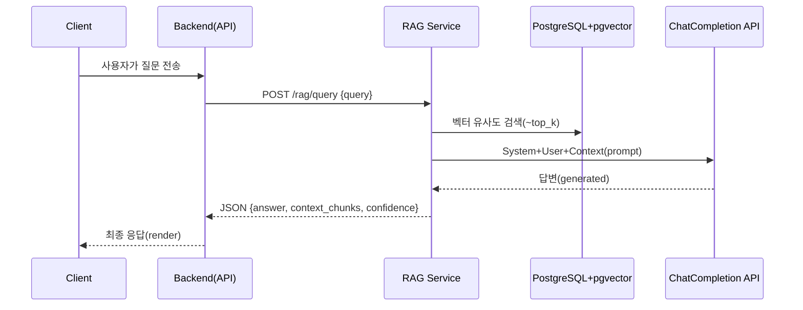

# RAG Query API 연동 가이드 (rag_integration.md)

본 문서는 **런타임 RAG(Retrieval-Augmented Generation)** 서비스를 백엔드/챗봇이 호출해
게임 지식 베이스에서 답변을 생성하는 과정을 설명합니다.  
(데이터 적재/임베딩 파이프라인은 `integration.md` 참고)

> ⚠️ 본 예시는 `rag-service` 마이크로서비스가 **포트 9100** 에 기동된다는 가정입니다.

---

## 1. 아키텍처 & 데이터 흐름



---

## 2. REST API 명세

### 2.1 요청

`POST /rag/query`

| 필드 | 타입 | 필수 | 설명 |
| ---- | ---- | ---- | ---- |
| `query` | string | ✅ | 사용자의 자연어 질문 |
| `top_k` | int |  | 벡터 검색 상위 N(기본 5) |
| `lang` | string |  | `ko` / `en` (미지정 시 자동 감지) |

### 2.2 응답(JSON)

| 필드 | 타입 | 설명 |
| ---- | ---- | ---- |
| `answer` | string | 최종 LLM 생성 답변 |
| `chunks` | array<object> | 참조된 지식 문단 목록 |
| `chunks[].text` | string | 문단 원문 |
| `chunks[].doc_id` | string | 문서 ID |
| `chunks[].score` | float | 품질 점수 |
| `confidence` | float | 0~1, LLM self-evaluation 또는 avg similarity |

HTTP Status: 200 성공, 429 rate-limit, 500 내부 오류

---

## 3. 예시 코드(FastAPI Client)

```python
import httpx, asyncio

RAG_URL = "http://rag-service:9100/rag/query"

async def ask_rag(question: str):
    async with httpx.AsyncClient(timeout=15.0) as client:
        resp = await client.post(RAG_URL, json={"query": question, "top_k": 5})
        resp.raise_for_status()
        data = resp.json()
        return data["answer"], data["chunks"], data["confidence"]

# 사용 예시
if __name__ == "__main__":
    ans, ctx, conf = asyncio.run(ask_rag("이번 패치에서 나서스 상향됐어?"))
    print(ans)
```

---

## 4. 파라미터 튜닝 가이드

| 파라미터 | 영향 | 권장 값 |
| --------- | ---- | ------- |
| `top_k` | 컨텍스트 다양성 vs 노이즈 | 3~8 |
| `temperature` | 창의도 | 0.2~0.5(정보성 QA) |
| `max_tokens` | 응답 길이 | 256 |

---

## 5. 모니터링 & 피드백

RAG 서비스는 `common/metrics.py` 의 지표를 동일하게 노출합니다.

| Metric | 설명 |
| ------ | ---- |
| `rag_query_total{hit}` | 벡터 검색 후 답변 성공(hit=true) 여부 |
| `rag_latency_seconds` | PG 검색+LLM 호출 전체 지연 |

또한 `POST /feedback` 엔드포인트로 `useful`/`not_useful` 피드백을 보내면 `rag_feedback` 테이블에 저장됩니다.

---

## 6. 보안 & Rate-Limit

* **Auth**: `Authorization: Bearer <token>` 헤더 기반 JWT 검사(예시).  
  백엔드 서비스 계정 전용 토큰을 발급/회전하세요.
* **Rate-Limit**: IP당 초당 5req, 동시 20conns(Envoy 필터)

---

## 7. FAQ

**Q1. 답변이 틀렸을 때 어떻게 개선하나요?**  
A. `/feedback` API로 not_useful 신호를 보내면 학습 데이터로 누적되고 정기적 재임베딩시 반영됩니다.

**Q2. 컨텍스트 길이 초과 오류가 납니다.**  
A. `top_k` 를 줄이거나 GPT-4o-128k 모델로 업그레이드하세요.

**Q3. 벡터 검색 속도가 느립니다.**  
A. pgvector index `ivfflat` ← `lists` 값 증가, `parallel_workers` 확대, `ANALYZE` 주기적 실행을 권장합니다.

---

문의: `#rag-platform` 슬랙 채널 또는 `ai-platform@yourcompany.com` 