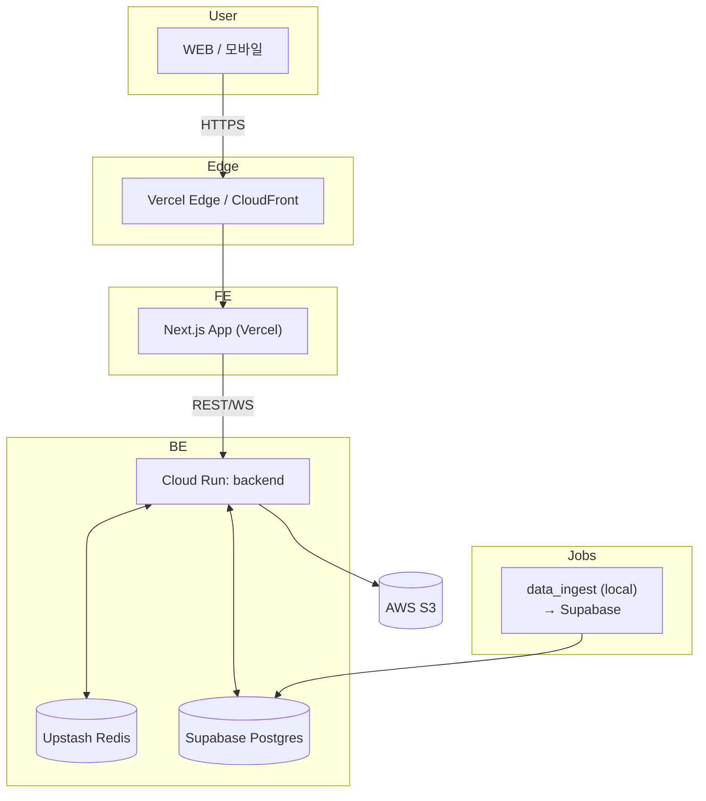

## 배포 절차 가이드

### 1. 전체 아키텍처 개요
- **Frontend**: Vercel(Preview & Production) → CloudFront(S3 정적 파일 선택사항)
- **Backend API**: GCP Cloud Run (CPU-only) ↔ Supabase(Postgres) ↔ Upstash(Redis)
- **Data Ingest**: 로컬 PC 또는 스케줄러(선택) → Supabase 로 직접 INSERT/UPDATE
- **Object Storage**: AWS S3 (raw 문서, 모델 artifact, 백업 파일 등)
- **CI/CD**: GitHub Actions → Terraform (GCP/AWS) → Vercel CLI 배포



### 2. 사전 준비
1. **터미널 도구**: `pnpm`, `python3.11`, `terraform`, `tflint`, `awscli`, `gcloud`, `vercel`
2. **클라우드 계정**:
   - AWS: S3 & IAM
   - GCP: Cloud Run & Artifact Registry (이미 구성됨)
   - Vercel: 프로젝트 연결(GitHub OAuth)
   - Supabase: `pgvector` 확장 활성화
   - Upstash: Redis free plan
3. **GitHub Secrets** 세팅
   - `AWS_ACCESS_KEY_ID`, `AWS_SECRET_ACCESS_KEY`
   - `GCP_SA_KEY`, `PROJECT_ID`
   - `VERCEL_TOKEN`, `VERCEL_ORG_ID`, `VERCEL_PROJECT_ID`
   - `SUPABASE_URL`, `SUPABASE_SERVICE_ROLE`
   - `UPSTASH_REDIS_REST_URL`, `UPSTASH_REDIS_REST_TOKEN`

### 3. Frontend – Vercel 배포
1. Vercel 프로젝트 생성 후 GitHub 레포 연결
2. **Environment Variables**
   | Key | Value |
   |-----|-------|
   | VITE_API_BASE_URL | `https://<api-domain>` |
   | NEXT_PUBLIC_SUPABASE_URL | `${SUPABASE_URL}` |
3. `vercel pull` 로 `.vercel/project.json` 생성 → 커밋
4. GitHub Actions `deploy.yml` 에 step 추가:
   ```yaml
   - name: Deploy FE
     run: |
       pnpm install -r
       pnpm build
       npx vercel deploy --prod --token ${{ secrets.VERCEL_TOKEN }}
   ```

### 4. Backend – GCP Cloud Run (기존)
`terraform/modules/cloudrun_backend` 사용. 빌드 & 배포 과정은 기존 문서 참조.
- `BACKEND_URL` Cloud Run 도메인 혹은 커스텀 도메인으로 설정
- Supabase / Redis / S3 자격 증명은 **Secret Manager → env var** 로 주입

### 5. AWS S3 정적 호스팅(선택)
> 프론트가 Vercel 로 배포될 경우 필수는 아니지만, 대용량 파일(예: 모델 스냅샷, raw data) 저장소로 활용합니다.
1. Terraform 모듈 `modules/s3_static_site` (새로 작성 필요)
2. 버킷 정책 예시:
   ```hcl
   resource "aws_s3_bucket_policy" "public_read" {
     bucket = aws_s3_bucket.static.bucket
     policy = data.aws_iam_policy_document.public_read.json
   }
   ```
3. 배포 스크립트 (GitHub Actions):
   ```yaml
   - name: Sync to S3
     run: aws s3 sync ./public s3://lvlup-assets --delete
   ```
4. (옵션) **CloudFront** + ACM HTTPS 설정

### 6. Database – Supabase(Postgres + pgvector)
1. Supabase 프로젝트 생성 → `Database Settings > Extensions` 에서 `pgvector` ON
2. `schema/*.sql` 을 `psql` 또는 Supabase SQL Editor 로 실행해 초기 스키마 구축
3. `auth.schema` 활성화 & RLS 정책 적용
4. 서비스 롤 키(`SUPABASE_SERVICE_ROLE`) GitHub Secrets 에 저장

### 7. Redis – Upstash
1. Upstash 콘솔에서 Redis 인스턴스 생성 (서울 리전 권장)
2. REST URL & Token을 환경 변수로 세팅:
   - `UPSTASH_REDIS_REST_URL`
   - `UPSTASH_REDIS_REST_TOKEN`
3. 백엔드 `services/cache.py` 에서 자동 인식 (URL 기반)

### 8. data_ingest 워커 실행(로컬)
```bash
cd data_ingest
python -m venv .venv && source .venv/bin/activate
pip install -r requirements.txt
cp env.example .env  # SUPABASE & OPENAI KEY 입력
make run  # 혹은 python scripts/adhoc_run.py
```
- 크론 등록 예: `0 * * * * cd ~/lvlup-ai-core/data_ingest && make run >> ingest.log 2>&1`
- GCP Cloud Scheduler 또는 GitHub Actions cron 으로도 대체 가능

### 9. 네트워킹 & 통신 설정
- **CORS**: Cloud Run → `*.vercel.app` & 프로덕션 도메인 허용
- **Supabase → Cloud Run**: `public`, `private` 서브넷 허용 + RLS
- **Redis**: Upstash 는 HTTPS REST, 인바운드 제한 필요 없음
- **S3**: 프리사인 URL 로만 접근하거나, `aws sts assume-role` 권장

### 10. 체크리스트
- [ ] GitHub Secrets ✅
- [ ] Terraform Apply (GCP, AWS) ✅
- [ ] Vercel 환경 변수 & 도메인 ✅
- [ ] Supabase 스키마 & RLS ✅
- [ ] Upstash 레디스 연결 ✅
- [ ] data_ingest cron ✅

> **TIP** : 모든 리소스 태깅에 `env`, `owner`, `project` 레이블 붙여 비용 추적을 쉽게 합니다. 